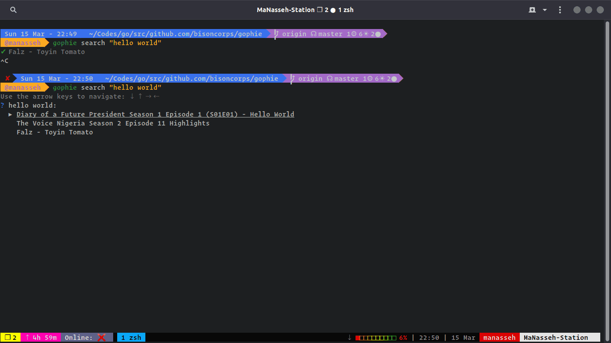

<p align="center"></p>

<div align="center">
  <a href="https://godoc.org/github.com/go-phie/gophie">
    
  </a>
  <a href="https://goreportcard.com/report/github.com/go-phie/gophie">
    
  </a>
  <a href="https://travis-ci.com/go-phie/gophie">
    
  </a>
</div>

# Gophie

Search, stream and download movies without having to bump into ads. Feel free to add any new movie sites

## What is Gophie

Gophie is a tool to help you search, stream and download movies from movie sites without going through all the stress of by-passing ads. Currently, the following sites are supported:

### Movies

- NetNaija
- FzMovies
- BestHD
- MyCoolMoviez

### Series

- TvSeries

More Sites and more variations (such as animes and series) will come in to play quite soon.

Gophie also has [mobile](https://github.com/Go-phie/gophie-mobile) and [web](https://github.com/Go-phie/gophie-web) clients.

## Installation
With Golang installed

```bash
go get github.com/go-phie/gophie
```
Or download from Github [Releases](https://github.com/go-phie/gophie/releases)

## Usage

### CLI

gophie


```bash
>>> gophie
Gophie

Usage:
  gophie [command]

Available Commands:
  api         host gophie as an API on a PORT env variable, fallback to set argument
  engines     Show summary and list of available engines
  help        Help about any command
  list        lists the recent movies by page number
  resume      resume downloads for previously stopped movies
  search      search for a movie
  stream      Stream a video from gophie
  version     Get Gophie Version

Flags:
  -e, --engine string       The Engine to use for querying and downloading (default "netnaija")
  -h, --help                help for gophie
  -o, --output-dir string   Path to download files to
  -v, --verbose             Display Verbose logs

Use "gophie [command] --help" for more information about a command.


Gophie - Bisoncorp (2020) (https://github.com/go-phie/gophie)
```

For Development use `go run main.go [command]`

## Deployment

The deployed API version from `gophie api` is available on [Heroku](https://deploy-gophie.herokuapp.com). Please read the API documentation for usage

## License

This project is opened under the [GNU AGPLv3](https://github.com/go-phie/gophie/blob/master/LICENSE) which allows very broad use for both academic and commercial purposes.


## Credits
Library/Resource | Use
------- | -----
[github.com/gocolly/colly](https://github.com/gocolly/colly) | scraping the net for links
[github.com/manifoldco/promptui](https://github.com/manifoldco/promptui/) | interactive CLI
[github.com/spf13/cobra](https://github.com/spf13/cobra) | CLI interface
[github.com/iawia002/annie](https://github.com/iawia002/annie) | Downloader (resume capabilities)
[Stoplight](https://stoplight.io) | Generating API docs
